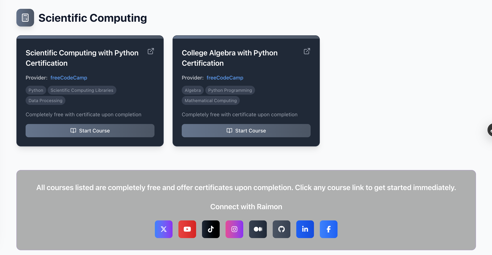

# Free Software Development Courses with Certificates

A curated collection of completely free software development courses that offer certificates upon completion. This Next.js website showcases 34 courses organized by topic, covering various aspects of software development from frontend to backend, security, data science, and cloud computing.

## 🌐 Live Demo

**[🚀 Visit Free Courses Website](https://courses-free-with-certificate.vercel.app)**



## ✨ Features

- **34 Free Courses**: Comprehensive collection of courses with certificates
- **13 Categories**: Organized by Frontend, Backend, Security, Data Science, Cloud Computing, and more
- **Dark Mode Toggle**: Seamless light/dark theme switching with localStorage persistence
- **Beautiful UI**: Linear gradient styling, hover effects, and responsive design
- **Lucide Icons**: Category-specific icons for enhanced visual appeal
- **Interactive Cards**: Each course displays provider, topics, duration, and direct links
- **Verified Links**: All course links tested and verified to work correctly

## 🚀 Getting Started

### Prerequisites

- Node.js 18+ 
- pnpm (recommended) or npm/yarn

### Installation

1. Clone the repository:
```bash
git clone https://github.com/raimonvibe/courses-free-with-certificate.git
cd courses-free-with-certificate
```

2. Install dependencies:
```bash
pnpm install
# or
npm install
```

3. Run the development server:
```bash
pnpm dev
# or
npm run dev
```

4. Open [http://localhost:3000](http://localhost:3000) in your browser

## 🛠️ Tech Stack

- **Framework**: Next.js 15 with App Router
- **Language**: TypeScript
- **Styling**: Tailwind CSS v4
- **Icons**: Lucide React
- **Fonts**: Geist Sans & Geist Mono
- **Deployment**: Vercel (recommended)

## 📚 Course Categories

The website features courses in the following categories:

- 🎨 **Frontend Development** (2 courses)
- 🗄️ **Backend Development** (3 courses) 
- 🛡️ **Security & Cybersecurity** (5 courses)
- 📊 **Data Science** (1 course)
- ☁️ **Cloud Computing** (4 courses)
- 🔧 **DevOps & Infrastructure** (3 courses)
- 🧠 **Machine Learning & AI** (4 courses)
- 👥 **Soft Skills & Management** (2 courses)
- 🎨 **Design & UX** (2 courses)
- 📈 **Business & Analytics** (3 courses)
- 🧪 **Quality Assurance** (2 courses)
- 🔢 **Mathematics & Algorithms** (2 courses)
- 📱 **Mobile Development** (1 course)

## 🌙 Dark Mode

The website includes a fully functional dark mode toggle that:
- Persists user preference in localStorage
- Respects system color scheme preference
- Smoothly transitions between themes
- Updates all UI components consistently

## 🔗 Course Providers

Courses are sourced from reputable providers including:
- freeCodeCamp
- Microsoft Learn
- AWS Skill Builder
- IBM SkillsBuild
- Coursera
- edX
- And more...

## 📱 Responsive Design

The website is fully responsive and optimized for:
- Desktop computers
- Tablets
- Mobile devices
- Various screen sizes and orientations

## 🚀 Deployment

### Deploy on Vercel (Recommended)

1. Push your code to GitHub
2. Connect your repository to [Vercel](https://vercel.com)
3. Deploy with zero configuration

### Other Platforms

The website can be deployed on any platform that supports Next.js:
- Netlify
- Railway
- DigitalOcean App Platform
- AWS Amplify

## 🤝 Contributing

Contributions are welcome! Please feel free to submit a Pull Request. For major changes, please open an issue first to discuss what you would like to change.

## 📄 License

This project is licensed under the MIT License - see the [LICENSE](LICENSE) file for details.

## 👨‍💻 Author

Created by [Raimon Baudoin](https://github.com/raimonvibe) (@raimonvibe)

---

**Start your learning journey today with completely free courses that offer certificates upon completion!**
